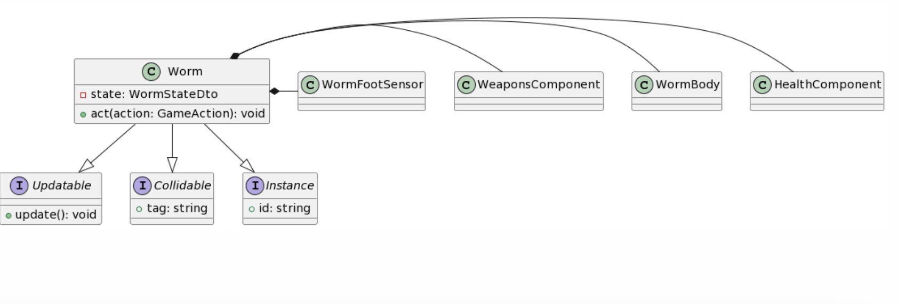

# Documentación Técnica server

- Introducción a la logica del juego del servidor


- Documentación de las armas, ¿Como agregar nuevas?


- Documentación de las configuraciones por YAML, ¿Como agregar nuevas?


- Documentación de las resoluciones de Colisiones dentro del juego, ¿Como agregar nuevas?


- La clase Worm

## Introducción

Dentro de la lógica del juego encontramos los **modelos** y los **sistemas**.

Tenemos **instancias**: Modelos especificos que requieren identificacion unica.

Dentro del loop del juego los sistemas en cada tick hacen un update que se encarga de actualizar la lógica propia de su sistema.
La idea es que estos sistemas estén desacoplados entre si, de ser requerido, conocen a las instancias y los actualizan acorde de lo que se encargue el sistema.

Los projectiles y worms implementan la interfaz Updatable y en cada tick. El UpdatablesSystem se encarga de llamar al update() de estas 2 instancias.
Dentro de este update los projectiles y worms implementan lógica a actualizar interna del modelo, que impacta en solo ellos mismos.

## Documentación implemetanción de sistema de armas

El siguiente diseño se decidió implementar debido a que mayormente la diferencia entre las armas se daba en los datos.

Dentro del juego tenemos armas que disparan projectiles.
Existen armas de disparo instantaneo y de disparo recargable.
Las armas se crean dinamicamente al inicilizarse el **WeaponsComponent** del **Worm** mediante los yaml:

- weapons.yaml
- projectiles.yaml

(Para mas información de las configuraciones por YAML, ver sección de YAML)

WeaponsComponent almacena las armas del gusano y al inicializarse con las configs obtenidas de los yaml.
Popula el mapa de armas con la WeaponFactory, esta se encarga de crear el arma con los Clase/valores/proyectil adecuado.

El Weapon se puede instanciar como un ChargeableWeapon o un InstantShotWeapon.
Ademas podra tendra alguna implementación de ProjectileCountdownDownChanger segun sea indicado en el yaml.

Por lo que se puede empezar a jugar con la creación dinamica de las armas y las distintas combinaciones.
Modificando armas y los proyectiles que disparan sin necesidad de recompilar.

## Para agregar un arma en el juego:

### Si no requiere funcionalidad nueva:

1) Agregar un nodo nuevo en el weapons.yaml y asociarle un projectil presente en projectiles.yaml (o crear un projectil nuevo)

### Ejemplo de un nodo de weapons.yaml:

```
type: BAZOOKA
projectile_id: 1
ammo: 8
shoot_power: 14
charge:
    time_to_charge: 1500
    initial_charged_percentage: 0.2
```

- Un **type**: que mapee a un **WeaponTypeDto** para que funcione como key dentro del map interno de WeaponsComponent y saber que sprite renderizar para el arma.
- **projectile_id**: id asociado al proyectil en **projectiles.yaml**, este sera el proyectil que disparara el arma.
- **ammo**: Cantidad de munición para el arma.
- **shoot_power**: Decimal con la cantidad de fuerza que disparar el arma (En caso de ser un arma cargable, sera la potencia maxima, tras cargar por completo)
- **charge**: Nodo opcional, si es que se quiere que el arma sea de disparo cargable. 
indicando con **time_to_charge**: la cantidad de tiempo que tardara en cargarse al maximo.
Y con **initial_charged_percentage**: el porcentaje de potenciador minimo ya cargado.

2) De ser necesario crear un nodo de proyectil nuevo para el arma en projectiles.yaml

### Ejemplo de un nodo de projectiles.yaml:

```
  type: P_MORTAR
  max_damage: 50
  explosion_radius: 2
  affected_by_wind: true
  rotation_type: VELOCITY_ALIGNED
  default_explosion_countdown: -1
  fragments:
    amount: 5
    max_damage: 10
    explosion_radius: 1
    affected_by_wind: true
```

- Un **type**: que mapee a un **ProjectileTypeDto** para saber que sprite renderizar para el projectil
- **max_damage**: El maximo daño que realiza el proyectil si es que impacta en el gusano en el epicentro.
- **explosion_radius**: Radio de impacto de explosion del proyectil.
- **affected_by_wind**: Booleano si el proyectil disparado sera o no afectado por el viento.
- **rotation_type**: VELOCITY_ALIGNED, INITIAL_ANGULAR_VELOCITY, NONE. Son las estrategias de rotacion para los proyectiles.
- **default_explosion_countdown**: -1 (Si se quiere que el proyectil explote en el impacto), de lo contrario el tiempo que tardara por defecto el proyectil en explotar.
- **fragments** nodo opcional, si es que se quiere que el proyectil al impactar dispare fragmentos a su alrededor.
Indicar la cantidad de fragmentos con **amount**, **max_damage**: el daño maximo en el epicentro, **explosion_radius**: radio de impacto del fragmento,
**affected_by_wind** si los fragmentos deben o no ser afectados por el viento.

De esta manera se pueden crear armas con distintas funcionalidades o proyectiles de manera rapida.

### Si se requieren funcionalidades nuevas:

1) Habra que tener en cuenta la funcionaldiad requerida, si sera necesario implementar una clase nuevo que extienda de Weapon,
o si la arma solo requerira extender de ChargeableWeapon o InstantShotWeapon.

Al no haber llegado con el tiempo no se implemntaron armas meles/teledirigias, pero igualmente habria que llegar a una clase padre comun de armas.
E igualmente podrian llegar a tener estas combinaciones como armas meles cargable/instantaneas.

2) Ver si es necesario agregar campos nuevos al nodo de arma en weapons.yaml

3) En base a la funcionalidad requerida/agregada, en el WeaponsFactory agregar el caso de la construcción del arma nueva.


## Documentación de configuraciones dinamicas para la partida por YAML

Actualmente se encuentra configurables:
- Algunos valores de la movilidad/vida de las worms
- Valores de las armas/proyectiles
- Valores del sistema de turnos

### Pasos para generar una configuración nueva

A continuacion se explica como agregar una configuracion por YAML nueva, usando el ejemplo del sistema de turnos.

1) Crear un .yaml con el diseño requerido para los datos a ser configurarables

```
turn_duration: 10000
match_duration: 1200000
time_after_ending_turn: 3000
```

2) Implementar un struct que vaya a almacenar los datos

```
struct TurnSystemCfg {
    int turn_duration;
    int match_duration;
    int time_after_ending_turn;
};
```

3) Extender el parse_file de la clase Config<T> siendo T el struct generado en el paso previo.
E implementar el parseo de los nodos del yaml con YAML.cpp hacia el struct generado.

```
template<>
void Config<TurnSystemCfg>::parse_file() {
    try {
        YAML::Node main_node = YAML::LoadFile(WEAPONS_CFG_PATH);
        TurnSystemCfg cfg;
        cfg.turn_duration = main_node["turn_duration"].as<int>();;
        cfg.match_duration = main_node["match_duration"].as<int>();;
        cfg.time_after_ending_turn = main_node["time_after_ending_turn"].as<int>();;
        config.emplace(1, cfg);
    
    } catch (const YAML::Exception &e) {
        std::cerr << "YAML parsing error: " << e.what() << " on WeaponConfig.cpp" << std::endl;
        throw (e);
    } catch (const std::invalid_argument &e) {
        std::cerr << e.what() << std::endl;
        throw (e);
    }
}
```

4) Agregar la nueva config como miembro del GameInstance, en la construccion del GameInstance, se construira la nueva extension de config
y se correra el parse_file implementado, quedando en el struct los valores necesarios.

```
class GameInstance {
    Config<TurnSystemCfg> turn_system_cfg;
}
```

5) Listo! Utilizar los valores obtenidos del YAML para hidratar las clases que sean necesarias.
  El Config<T> implementa un .front() para el caso de que sea una unica config T.
Y tambien implementa un iterador para los casos que se requiera una colección de configs T.


### Documentación de las resoluciones de Colisiones dentro del juego

A continuación se desarrolla una introducción de la arquitectura de resolución de colisiones y como agregar nuevas funcionalidades tras colisiones.

## Introducción

A lo largo del loop del juego nuestros modelos colisionaran. Ppodemos definir que queremos que pase
el inicio de una colisión entre dos modelos y que queremos que suceda tras la finalización de la colisión entre los 2 modelos.

Dentro de **PhysicsCollisionListener** escuchamos las colisiones de box2d,
de ser requerido realizaremos alguna funcionaldiad frente a esta colisión.

Mediante una mapa de pares de TAGS que apuntan a una funcion de resolucion.
Podremos agregar funcionalidades especificas para distintas colisiones, desacopladas de las demas.
Y con la posibilidad de ser especificos o genericos.

En la arquitectura planteada tenemos una interfaz **Collidable**, que debera implementar cualquier modelo que tenga un b2body
y le querramos definir alguna funcionalidad especifica dada su colisión.

El Collidable debe construirse con un TAG asociado al tipo de objeto que esta colisionando.
Gracias al TAG de ambos objetos que estan colisionando, se sabra de que manera resolver esa colisión.
Ya que habra una funcion asociada a esa pareja de **Collidables**

**NOTA**: No es necesario implementar de Collidable para que los objetos colisionen.
Esto se realiza para agregar funcionalidades especificas al momento de colisión.

Esta arquitectura esta basada en:
**"the double dispatch pattern" (article 31 in Meyer's more effective C++)**


## Como agregar resoluciones de colisiones nuevas

1) Hacer que el modelo implemente **Collidable** y que el modelo este asociado al userData pointer del b2body


2) Crearle un TAG en CollidableTags.h y asociarselo en el cosntructor de **Collidable**


3) Crear los Resolvers necesarios para el Collidable nuevo

Se puede generalizar si la funcionalidad de colision sera la misma de ese Collidable vs cualquier otro.
Como asi tambien se puede ser especifico de crear un resolver para cada par de colisión.
Eso dependera del requerimiento.

Tenemos un directorio begin_collision_resolvers para la resolucion de inicio de colision entre 2 Collidables.

Y un directorio end_collision_resolvers para la resolucion de fin de colision entre 2 Collidables.

Crear el Resolver en el directorio adecuado
La nomenclatura para las clases de los Resolvers es:

Comenzar con B los resolver de on begin collision.

Comenzar con E los resolvers de end collision.

Seguido de: nombre del primer collidable, 'W' el segundo collidable.
Any para un caso generico.

Ejemplo: BProjectileWAny

4) El resolver debera implementar un resolve y un resolve inverse, ya que no nos podemos asegurar en que orden nos pasara box2d el evento de colision

Ejemplo
```
class BProjectileWAny {
public:
BProjectileWAny() = default;

    static void resolve(Collidable *projectile_collidable, Collidable *any, b2Contact* contact);

    static void resolve_inverse(Collidable *any, Collidable *projectile_collidable, b2Contact* contact);
};
```

5) Adentro del resolver se puede castear con tranquilidad los objetos sabiendo que se esa funcion se ejecuta solamente
para los Collidables requeridos. Tambien tenemos la informacion del contacto

Ejemplo
```
void BProjectileWAny::resolve(Collidable *projectile_collidable, Collidable *any, b2Contact* contact) {
  auto projectile = dynamic_cast<Projectile*>(projectile_collidable);
  if (projectile != nullptr && !projectile->has_exploded()) {
    b2WorldManifold world_manifold;
    contact->GetWorldManifold(&world_manifold);
    projectile->on_collision(world_manifold.points[0]);
  } 
}
```

6) Implementar la resolucion inversa, simplemente llamando a la orginial con los parametros invertidos
(Ya que no sabremos en que orden llegara la collision del listener de box2d)
Ejemplo:

```
void BProjectileWAny::resolve_inverse(Collidable *any, Collidable *projectile_collidable, b2Contact* contact) {
  resolve(projectile_collidable, any, contact);
}
```

7) Finalmente, agregar el resolver al mapa de resolvers en PhysicsCollisionListener.
Si era un Resolver de principio de colision

```
beginning_hit_map.insert(
  std::make_pair(std::make_pair(PROJECTILE_TAG, WORM_TAG), &BProjectileWAny::resolve)
);
beginning_hit_map.insert(
  std::make_pair(std::make_pair(WORM_TAG, PROJECTILE_TAG), &BProjectileWAny::resolve_inverse)
);
```

Si era un Resolver de fin de colision, lo mismo pero en:
```
ending_hit_map
```

Listo! La funcionalidad sera ejecutada cada vez que el par de Collidables inicie/finalice la colision

## Worm

Es el personaje principal del juego aquel que el jugador estara controlando.

Se encarga de redirigir las acciones requeridas hacia su/sus componentes para esa accion dada.
Centralizando la data de la worm.


