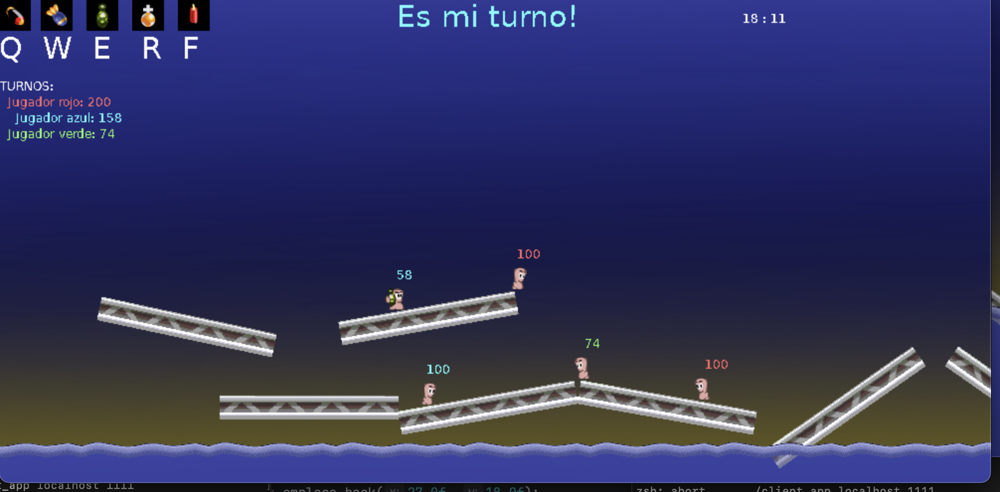

# Manual de Usuario

Instalaciones necesarias:
- SDL
- QT


## Instalación de SDL

Para **Linux** ejecutar en la consola:
```shell
sudo apt-get install libsdl2-2.0-0  libsdl2-dev \
libsdl2-image-2.0-0 libsdl2-image-dev \
libsdl2-mixer-2.0-0 libsdl2-mixer-dev \
libsdl2-ttf-2.0-0 libsdl2-ttf-dev \
```

Para **MacOS** ejecutar en la consola
```shell
brew install sdl2
```

En el caso de no tener **brew** instalarlo con:

```shell
/bin/bash -c "$(curl -fsSL https://raw.githubusercontent.com/Homebrew/install/HEAD/install.sh)"
```

## Instalacion de QT

Para Linux ejecutar en la consola:
```shell
```

Para MacOS ejecutar en la consola
```shell
brew install qt
```

## Compilación

Para realizar la compilación dentro de la carpeta `build/` del proyecto, ejecutar:

```shell
cmake ..
make
```

Los binarios se generan en la carpeta `build/bin/`

## correr los ejecutables del server y del cliente

### Servidor:

```shel
./server_app [port]
```

Ejemplo:

```shell
./server_app 1111
```

### Cliente: 

```shel
./client_app [serv] [port]
```

Ejemplo:

```shell
./client_app localhost 1111
```

Esto abrira el launcher the QT, donde se podran crear partidas, unirse y comenzarlas.


#### Crear una partida
Escribir un nombre para la partida, elegir cantidad de jugadores y presionar "Crear".

#### Listar Partidas
Para poder unirse a una partida primero hay que pedir el listado de partidas, presionando "Listar partidas".

#### Unirse a partida
Elegir entre una partida entre la lista y presionar unirse.

#### Esperar comienzo de partida
Una vez dentro de la sala, si se quiere esperar a que comience presionar "Ir a la sala de espera".

#### Comenzar partida
Un usuario debera ser quien comienza la partida, este, una vez unido a la partida, debera presionar "Iniciar".

### Que comienze la partida!



#### Como jugar
Una vez comenzada la partida, espera tu turno para realizar tus jugadas y matar a los demas gusanos!

- **Movimiento**: Flechas izquierda/derecha
- **Salto hacia delante**: Enter
- **Salto hacia atras**: Delete
- **Disparos**: Presionar/Mantener/Soltar espacio
Algunos disparos pueden ser cargados manteniendo la tecla espacio.
- **Cambio de arma**: Con las teclas q/w/e/r/f se podra escoger un arma nueva
- **Cheats**: z: cheat de vida (Inmunidad a projectiles), c: cheat de arma (Recarga la municion del arma y aumenta el daño considerablemente)
